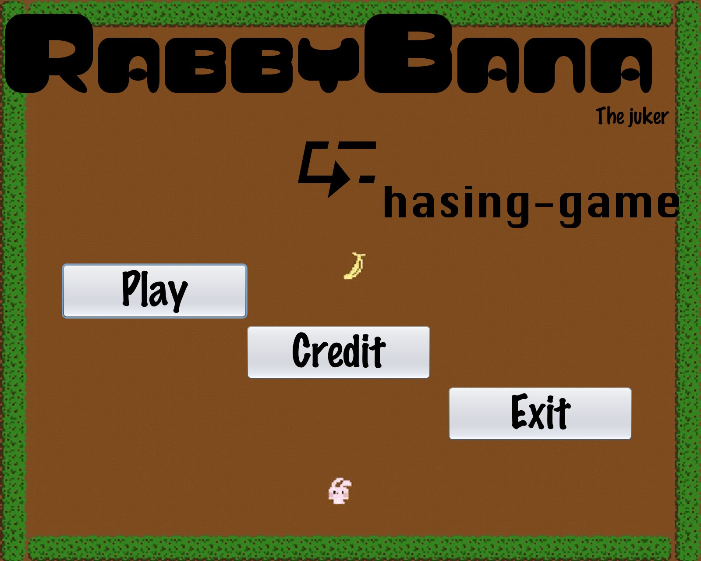
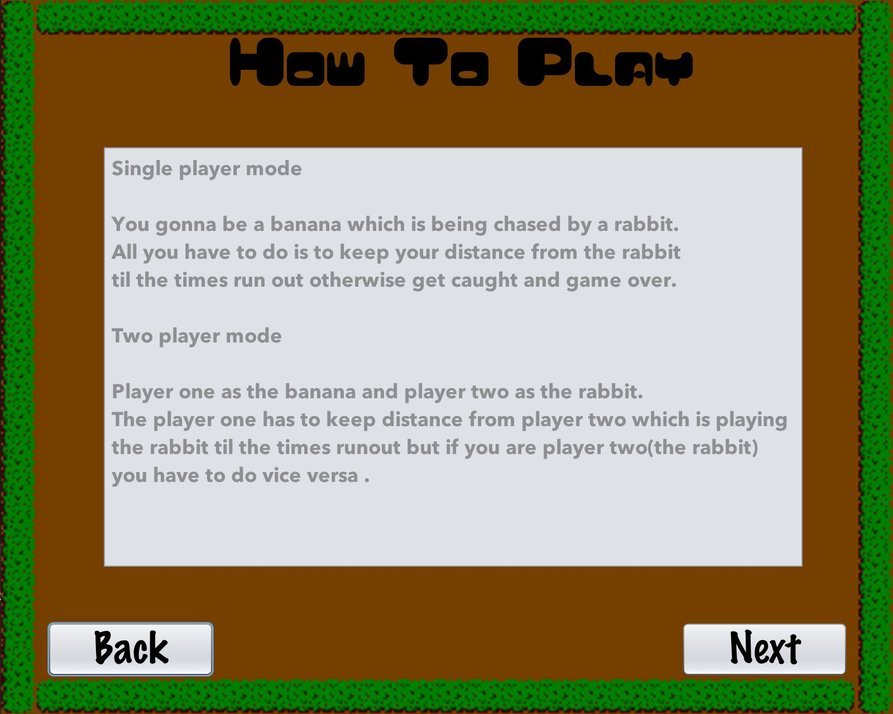
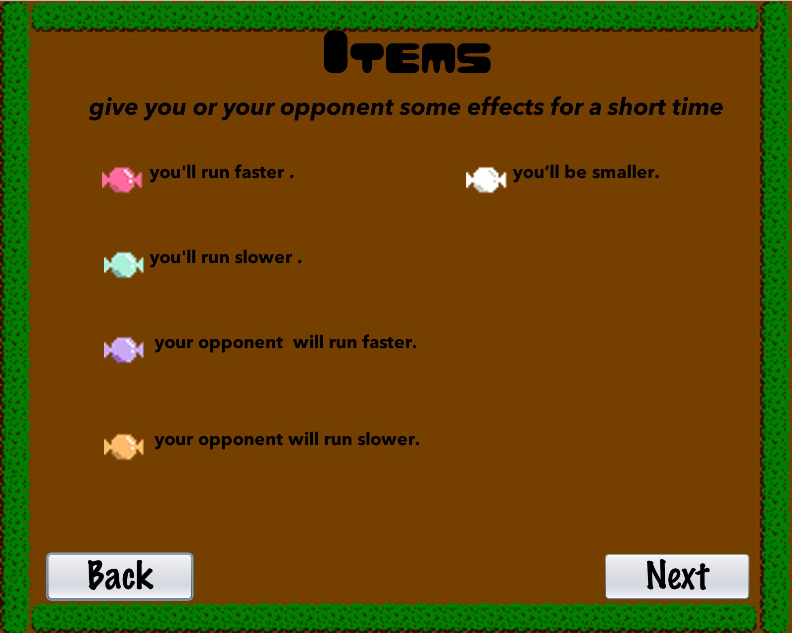
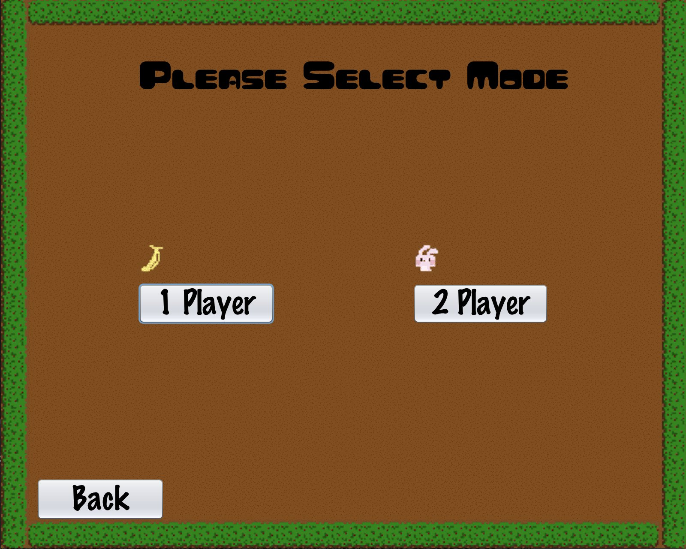
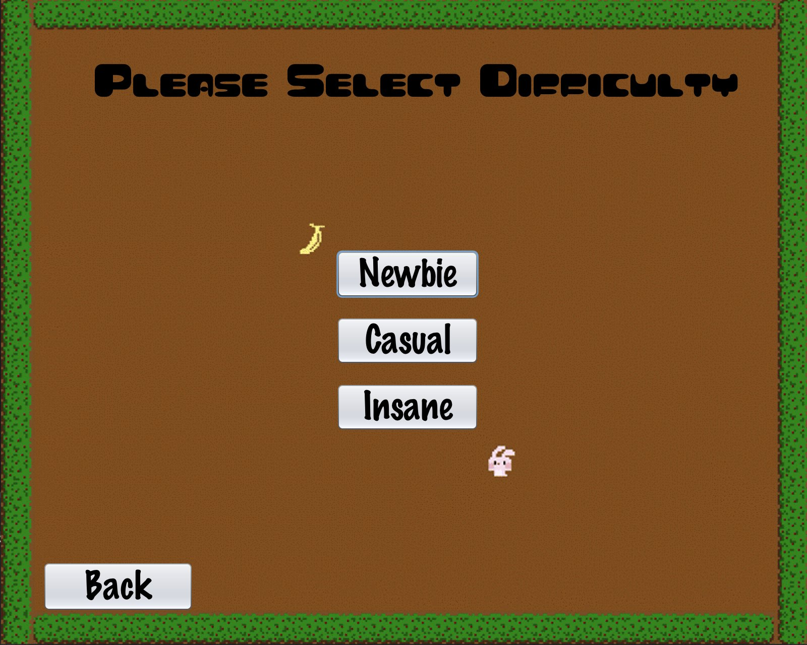
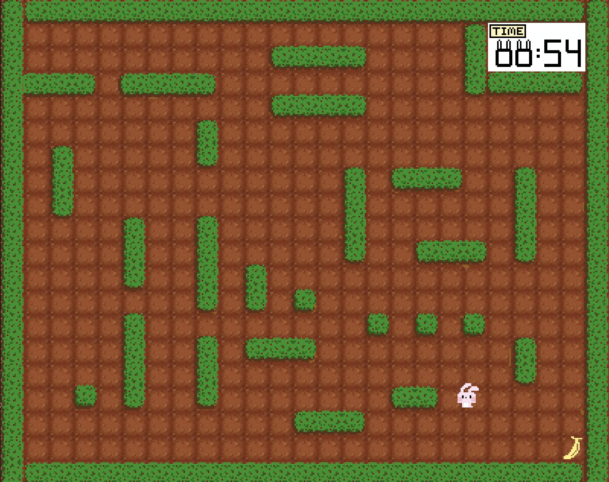

# Chasing-game-SKE 
by Gunthee Tawewatmongkol ID 6010546915 & Korawit Rupanya ID 6010545684

**Contents**
- [The inspiration](#the-inspiration)
- [What we use in this game](#what-we-use-in-this-game)
- [How to play the game](#how-to-play-the-game)

# The inspiration
We get the inspiration from the classic pac-man game.We want to do a game like that iconic game so we made it but in our style.

# What we use in this game
We use some knowledge that we got from the course like the object,the polymorphism and some other stuff from the internet.

# How to play the game
	
you can download the game and run it on your IDE or by open jar file 
	Click [here](https://github.com/KameriiJ/Chasing-game-SKE) to get the latest version of this application.
	Click [here2](https://drive.google.com/open?id=1afX_BI5sK4UPi5P2sqG-Umg3VWb8rsrf)

you can download the game and run it on your IDE or by open jar file 
    Click [here](https://github.com/KameriiJ/Chasing-game-SKE) to get through the git hup repo.
    Click [here](https://drive.google.com/open?id=1afX_BI5sK4UPi5P2sqG-Umg3VWb8rsrf) to get jar file. (Update 15/12/2017)

## -Single Player-

    You gonna be a banana which is being chased by a rabbit.
    All you have to do is to keep your distance from the rabbit 
    til the times run out otherwise get caught and game over.

## -Two Players-

    Player one as the banana and player two as the rabbit.
    The player one has to keep distance from player two 
    which is playing the rabbit until the times run out but 
    if you are player two(the rabbit) you have to do vice versa.

## Items
    In the game, the items is toffy that has many different color.
    There are 5 different color.(pink, light-blue, purple, orange and white)

   ### Simple items

	1.) pink item - make player faster
 	2.) light blue item - make player slower
 	3.) purple item - make enemy faster
 	4.) orange item - make enemy slower

  ### Special items

	This item is white.
	It will make player or enemy(rabbit) smaller(from 30*30 to 16*16).

## What actually inside this game.

    

